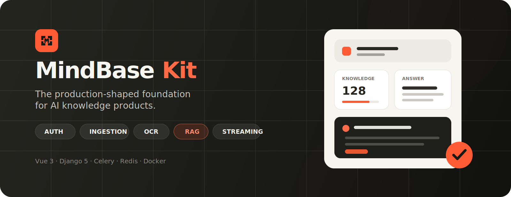
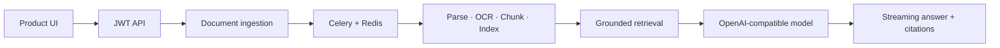

<p align="center">
  
</p>

<p align="center">
  <strong>Launch an AI knowledge product without rebuilding the foundation.</strong><br />
  Authentication, document ingestion, OCR, grounded answers, citations, streaming, async jobs, and deployment — already connected.
</p>

<p align="center">
  <a href="#see-it-in-action">Product tour</a> ·
  <a href="#start-in-minutes">Quick start</a> ·
  <a href="docs/STARTER_KIT.md">Starter guide</a> ·
  <a href="docs/engineering/架构设计.md">Architecture</a> ·
  <a href="docs/product/产品路线图.md">Roadmap</a>
</p>

<p align="center">
  
  
  
  
</p>

---

MindBase Kit is a production-shaped starter for teams building AI products around private knowledge. The included knowledge workspace proves the complete path from sign-in and upload to retrieval, cited answers, and operations. Replace the demo domain with your own product instead of starting again from infrastructure.

> **A starter, not a staged concept.** Core workflows are connected end to end. Team management and billing are intentionally delivered as adapter surfaces so you can integrate your own permission and payment providers without inheriting fake backend behavior.

## See it in action

<p align="center">
  
</p>

<p align="center"><sub>Recorded from the current repository build. No concept screens or unrelated marketing mockups.</sub></p>

## What you can build

| Internal knowledge copilot | Customer support assistant | Research workspace | Vertical AI SaaS |
|---|---|---|---|
| Search policies, handbooks, and operational documents with traceable answers. | Ground responses in product documentation and approved support content. | Organize source material, extract content, and ask questions with citations. | Reuse the foundation for legal, education, healthcare, finance, or other domain products. |

## What ships with the kit

| Capability | Delivery | What is included |
|---|---|---|
| Authentication | **Connected** | Registration, login, JWT refresh, logout, protected routes, and user state |
| Knowledge ingestion | **Connected** | Upload, parsing, chunking, OCR, indexing, and optional visual description |
| Grounded chat | **Connected** | RAG, citations, streaming responses, stop generation, and hybrid web search |
| Background work | **Connected** | Celery workers, Redis queues, ingestion progress, and retry-ready task boundaries |
| Operations | **Connected** | Docker Compose, Nginx, Gunicorn, MySQL, Redis, and health checks |
| Team & access | **Adapter** | Product-ready UI and domain boundaries for roles, API keys, and audit events |
| Billing | **Adapter** | Provider-neutral plans, usage states, and subscription event surfaces |

**Connected** means the frontend, backend, and runtime path work together. **Adapter** means the product surface and integration boundary are present, while provider-specific business logic remains yours.

## A foundation you can actually reshape

- **Feature-first frontend** — product surfaces live under `features/`, while app wiring, configuration, and shared components stay separate.
- **Replaceable providers** — model, search, vision, storage, permission, and billing integrations are kept behind clear boundaries.
- **Honest demo domain** — the knowledge workspace validates the system, but does not dictate the product you build.
- **Production-shaped runtime** — web, API, worker, database, cache, proxy, and health checks are included from day one.



## Start in minutes

```bash
cp .env.example .env
docker compose up -d --build
```

| Entry point | URL |
|---|---|
| Product landing page | `http://localhost:8080` |
| Demo workspace | `http://localhost:8080/app` |
| API health check | `http://localhost:8080/api/v1/health/` |
| Django admin | `http://localhost:8080/admin/` |

Create the first administrator:

```bash
docker compose exec backend python manage.py createsuperuser
```

> Before production use, replace the example secrets and configure your AI provider, domain, database credentials, and storage policy. See the [environment guide](docs/devops/环境配置.md) and [deployment guide](docs/devops/部署指南.md).

## Customize without a rewrite

1. **Change the brand and navigation** in `frontend/src/config/starter.ts`.
2. **Keep or remove product surfaces** under `frontend/src/features/`.
3. **Rename the demo domain** from Notebook to Project, Case, Customer, Workspace, or your own core object.
4. **Connect providers** for models, search, object storage, permissions, and billing at the existing boundaries.

```text
frontend/src/
├── app/            # application entry, router, and authenticated shell
├── config/         # brand, navigation, and module manifest
├── features/       # marketing, auth, dashboard, knowledge, chat, admin, billing
├── components/     # reusable UI, navigation, brand, and domain components
├── api/            # HTTP contracts and interceptors
├── stores/         # Pinia state
└── styles/         # design tokens and shared primitives
```

The backend follows the same principle: domain apps stay separate from Django configuration, background workers, provider integrations, and deployment concerns.

## Technology

| Layer | Stack |
|---|---|
| Web | Vue 3, TypeScript, Vite, Pinia, Vue Router, Tailwind CSS |
| API | Django 5, Django REST Framework, SimpleJWT |
| AI | OpenAI-compatible models, RAG, Tavily hybrid search, OCR, optional vision |
| Data & async | MySQL or SQLite, Redis, Celery |
| Runtime | Docker Compose, Nginx, Gunicorn |

## Local development

<details>
<summary><strong>Run the backend and frontend separately</strong></summary>

Backend:

```bash
cd backend
python -m venv venv
venv\Scripts\activate
pip install -r requirements.txt
python manage.py migrate
python manage.py runserver
```

Frontend:

```bash
cd frontend
pnpm install
pnpm dev
```

Development dependencies only:

```bash
docker compose -f docker-compose.dev.yml up -d
```

</details>

<details>
<summary><strong>Run the verification suite</strong></summary>

```bash
cd frontend
pnpm typecheck
pnpm lint
pnpm test
pnpm build

cd ../backend
python manage.py check
python manage.py test apps.chat apps.documents apps.notebooks apps.users
```

</details>

## Documentation

| Build | Understand | Operate |
|---|---|---|
| [Starter Kit guide](docs/STARTER_KIT.md) | [Architecture](docs/engineering/架构设计.md) | [Environment](docs/devops/环境配置.md) |
| [API conventions](docs/engineering/API规范.md) | [RAG architecture](docs/ai/RAG架构.md) | [Deployment](docs/devops/部署指南.md) |
| [Product roadmap](docs/product/产品路线图.md) | [Changelog](docs/CHANGELOG.md) | [Docker Compose](docker-compose.yml) |

---

<p align="center">
  <strong>Build the product that makes your knowledge useful.</strong><br />
  Start with the connected foundation. Keep the domain, design, and business model yours.
</p>

<p align="center">
  <a href="https://github.com/Magic181/mindbase-kit/issues">Report an issue</a> ·
  <a href="docs/STARTER_KIT.md">Read the starter guide</a> ·
  <a href="#start-in-minutes">Run locally</a>
</p>
