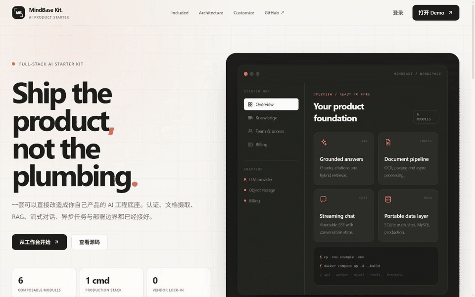

# MindBase Kit

一个可拆、可换、可直接运行的 AI 产品 Starter Kit。

MindBase Kit 提供完整 Demo，但 Notebook 不是项目边界。真正可复用的是认证、文档摄取、OCR、RAG、流式对话、异步任务和部署基础设施。Team 与 Billing 页面被明确设计为 optional adapter surface，不会伪装成已经完成的商业系统。

## Current UI demo

<p align="center">
  
</p>

> 该 GIF 由当前仓库版本的真实页面录制。发布 UI 改动时必须同步重录，无法同步时应直接移除，避免展示与代码不一致。

## What is included

| 模块 | 状态 | 内容 |
|---|---|---|
| Authentication | Wired | 注册、登录、JWT refresh、logout、路由守卫 |
| Knowledge ingestion | Wired | 上传、解析、chunk、OCR、可选视觉描述 |
| Grounded chat | Wired | RAG、引用、流式输出、停止生成、混合搜索 |
| Operations | Wired | Docker Compose、Nginx、Celery、Redis、MySQL、health check |
| Team & access | Adapter | 角色、API Key、审计事件的 UI 与数据边界参考 |
| Billing | Adapter | 套餐、用量、订阅事件的 provider-agnostic surface |

## Stack

| Layer | Technology |
|---|---|
| Frontend | Vue 3, TypeScript, Vite, Pinia, Vue Router, Tailwind CSS |
| Backend | Django 5, Django REST Framework, SimpleJWT |
| AI | OpenAI-compatible API, RAG, Tavily hybrid search, OCR, optional vision |
| Async & data | Celery, Redis, MySQL / SQLite |
| Deploy | Docker Compose, Nginx, Gunicorn |

## Quick start

```bash
cp .env.example .env
docker compose up -d --build
```

- Landing: `http://localhost:8080`
- Demo workspace: `http://localhost:8080/app`
- API health: `http://localhost:8080/api/v1/health/`
- Django admin: `http://localhost:8080/admin/`

创建管理员：

```bash
docker compose exec backend python manage.py createsuperuser
```

## Project structure

```text
mindbase-kit/
├── backend/
│   ├── apps/                  # users, notebooks, documents, chat, core
│   └── config/                # Django, Celery and environment wiring
├── frontend/
│   └── src/
│       ├── app/               # app entry, router and authenticated shell
│       ├── config/            # brand, navigation and starter module manifest
│       ├── features/          # marketing, auth, dashboard, knowledge, chat, admin, billing
│       ├── components/        # reusable brand, navigation, UI and domain components
│       ├── api/               # HTTP contracts and interceptors
│       ├── stores/            # Pinia state
│       └── styles/            # design tokens and shared component primitives
├── docs/                      # architecture, API, RAG and deployment guides
├── docker-compose.yml         # full production-style local stack
└── docker-compose.dev.yml     # MySQL + Redis for local development
```

## Customize the kit

1. 修改 `frontend/src/config/starter.ts`，集中替换品牌、导航、仓库地址和模块声明。
2. 在 `frontend/src/features/` 保留需要的 surface，删除 optional feature 不会影响认证、摄取或 RAG。
3. 在后端 service/storage/provider 边界接入自己的模型、对象存储、搜索、团队权限和计费系统。
4. 同步调整 `.env.example` 与对应文档，避免隐藏配置。

更完整的裁剪说明见 [Starter Kit 使用指南](docs/STARTER_KIT.md)。

## Local development

Backend:

```bash
cd backend
python -m venv venv
venv\Scripts\activate
pip install -r requirements.txt
python manage.py migrate
python manage.py runserver
```

Frontend:

```bash
cd frontend
pnpm install
pnpm dev
```

只启动开发依赖：

```bash
docker compose -f docker-compose.dev.yml up -d
```

## Verification

```bash
cd frontend
pnpm typecheck
pnpm lint
pnpm test
pnpm build

cd ../backend
python manage.py check
python manage.py test apps.chat apps.documents apps.notebooks apps.users
```

## Documentation

- [Starter Kit 使用指南](docs/STARTER_KIT.md)
- [架构设计](docs/engineering/架构设计.md)
- [API 规范](docs/engineering/API规范.md)
- [RAG 架构](docs/ai/RAG架构.md)
- [环境配置](docs/devops/环境配置.md)
- [部署指南](docs/devops/部署指南.md)
- [产品路线图](docs/product/产品路线图.md)

Repository: <https://github.com/Magic181/mindbase-kit>
