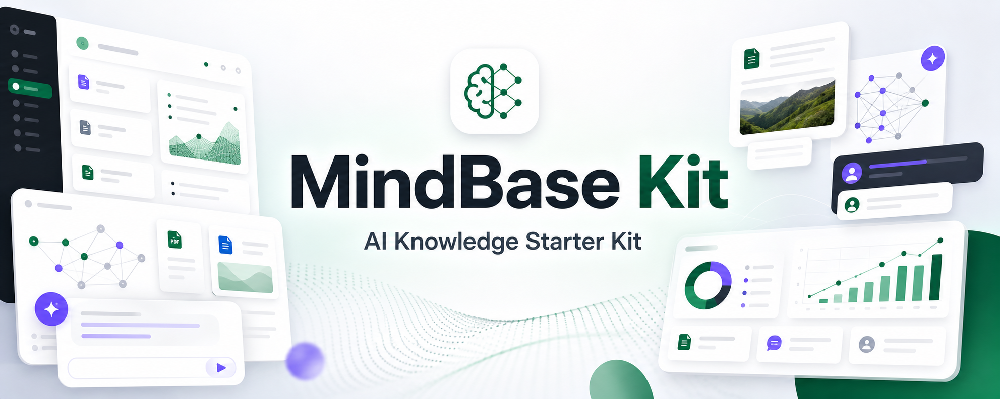
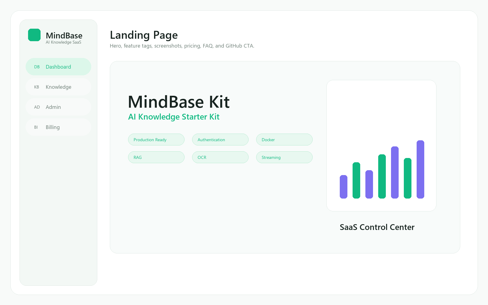
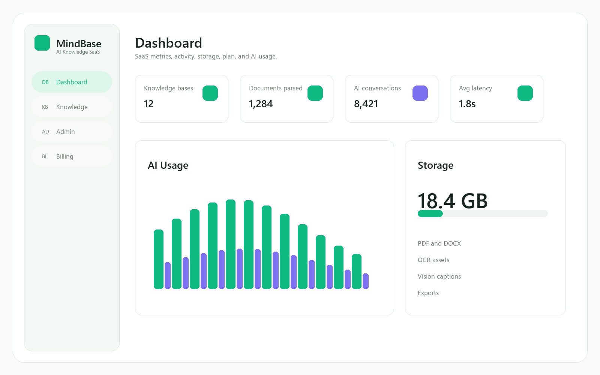
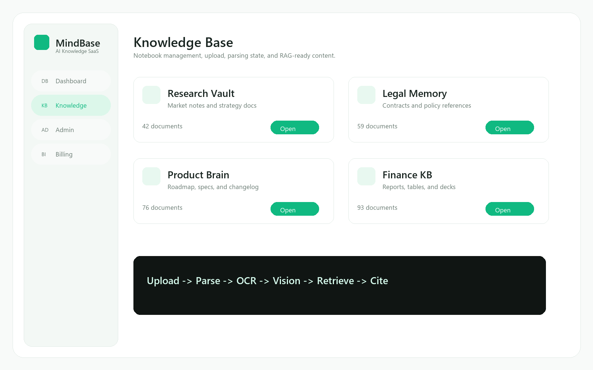
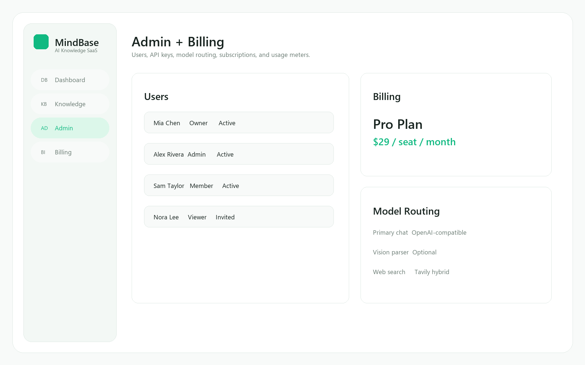

<p align="center">
  
</p>

<h1 align="center">MindBase Kit</h1>

<p align="center">
  <strong>Build AI Knowledge SaaS in Minutes.</strong>
</p>

<p align="center">
  Production Ready · Authentication · Docker · Responsive · AI SDK · RAG · OCR · Streaming · Deploy Ready · Starter Kit
</p>

<p align="center">
  <a href="http://localhost:8080">Demo</a>
  ·
  <a href="docs/README.md">Documentation</a>
  ·
  <a href="docs/product/产品路线图.md">Roadmap</a>
  ·
  <a href="docs/CHANGELOG.md">Changelog</a>
  ·
  <a href="#sponsor">Sponsor</a>
  ·
  <a href="#buy-pro">Buy Pro</a>
</p>

<p align="center">
  
  
  
  
  
  
  
  
  
  
  
  
  
  
</p>

## Demo Flow

<p align="center">
  
</p>

## Screenshots

| Landing | Dashboard |
|---|---|
|  |  |

| Knowledge Base | Admin + Billing |
|---|---|
|  |  |

## Why MindBase Kit

MindBase Kit is a production-oriented AI Knowledge Starter Kit. It ships with a complete demo product, but the real value is the reusable SaaS foundation: authentication, document ingestion, OCR, RAG, streaming chat, admin pages, billing-ready surfaces, and Docker deployment.

## Features

| Area | Included |
|------|----------|
| SaaS shell | Landing Page, Dashboard, Knowledge Base, Chat, Admin, Billing |
| Auth | Register, login, refresh, logout, JWT guards |
| Knowledge | Notebook CRUD, favorites, search, document upload, parse status |
| AI | OpenAI-compatible chat, DeepSeek defaults, streaming, Tavily hybrid search |
| RAG | Chunking, structure-aware retrieval, citations, OCR, optional vision captions |
| Admin Ready | Users, API keys, model routing, audit log UI surfaces |
| Pricing Ready | Plans, subscription state, usage meters, billing events |
| DevOps | Dockerfile, Docker Compose, Nginx, Gunicorn, Celery, MySQL, Redis |

## Tech Stack

| Layer | Stack |
|------|-------|
| Frontend | Vue 3, TypeScript, Vite, Pinia, Vue Router, Tailwind CSS, Element Plus |
| Backend | Django 5, Django REST Framework, SimpleJWT, PyMySQL |
| Async | Celery, Redis |
| Database | MySQL for Docker/self-hosting, SQLite for quick local mode |
| AI | DeepSeek/OpenAI-compatible API, Tavily Search, Tesseract OCR, optional vision models |
| Deploy | Nginx, Gunicorn, Docker Compose |

## Quick Start

```bash
cp .env.example .env
docker compose up -d --build
```

Open:

- Landing: `http://localhost:8080`
- Demo app: `http://localhost:8080/app`
- API health: `http://localhost:8080/api/v1/health/`

Create an admin user:

```bash
docker compose exec backend python manage.py createsuperuser
```

## Local Development

Backend:

```bash
cd backend
python -m venv venv
venv\Scripts\activate
pip install -r requirements.txt
python manage.py migrate
python manage.py runserver
```

Frontend:

```bash
cd frontend
pnpm install
pnpm dev
```

Development services only:

```bash
docker compose -f docker-compose.dev.yml up -d
```

## Project Structure

```text
AI-Notebook/
├── backend/                 # Django API, Celery, parsing, RAG
├── frontend/                # Vue app, SaaS shell, Landing, demo surfaces
├── docs/                    # Customer-facing docs, roadmap, changelog
├── docker-compose.yml       # One-command full-stack deployment
├── docker-compose.dev.yml   # MySQL + Redis for local development
└── .env.example
```

## Documentation

- [Starter Kit Guide](docs/STARTER_KIT.md)
- [Deployment Guide](docs/devops/部署指南.md)
- [Architecture](docs/engineering/架构设计.md)
- [API Spec](docs/engineering/API规范.md)
- [RAG Architecture](docs/ai/RAG架构.md)
- [Roadmap](docs/product/产品路线图.md)
- [Changelog](docs/CHANGELOG.md)

## GitHub Home

- ⭐ Demo: local Docker demo is ready at `http://localhost:8080`
- ⭐ Documentation: `docs/`
- ⭐ Roadmap: `docs/product/产品路线图.md`
- ⭐ Changelog: `docs/CHANGELOG.md`
- ⭐ Sponsor: open source support section ready
- ⭐ Buy Pro: commercial template path ready

## Sponsor

MindBase Kit is structured so an open-source edition and a Pro template can coexist. Sponsor links can point to GitHub Sponsors, Ko-fi, Lemon Squeezy, or Polar when you are ready.

## Buy Pro

The Pro path can include hosted demo, premium docs, Stripe integration, SSO, workspace roles, vector database adapters, and deployment templates.

## Repository

https://github.com/Magic181/AI-notebook
